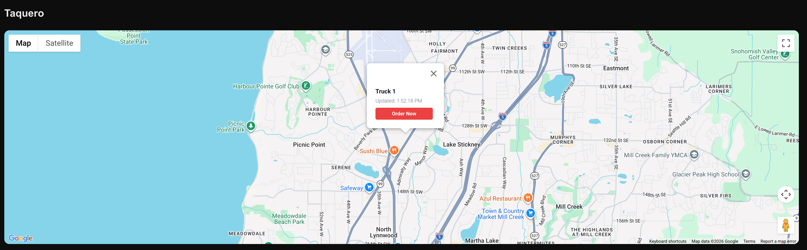
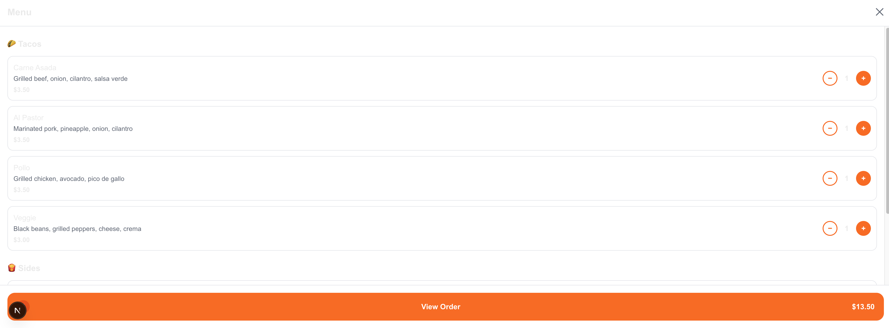
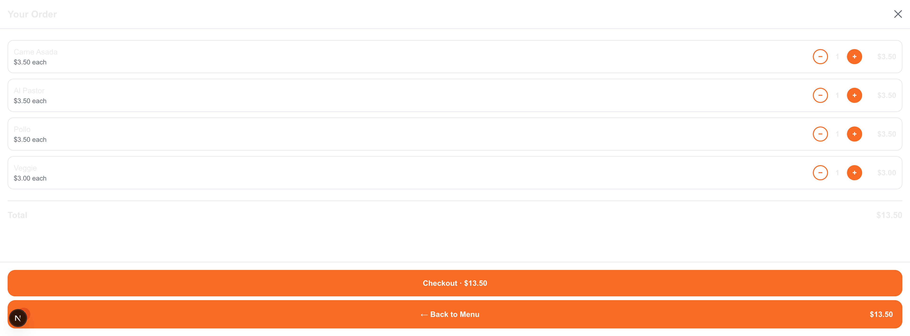
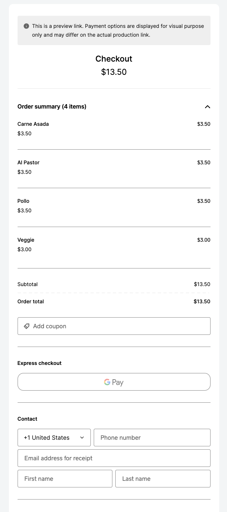

# 🌮 Taquero

**Taquero** is a real-time GPS tracking and ordering platform for taco trucks. Customers can find nearby trucks on a live map, browse the menu, build a cart, and check out — all in one flow.

Built for the Lynnwood, WA Highway 99 market.

---

## Screenshots

### Live Map — Find the Truck


### Tap the Pin — Truck Info & Order Now


### Browse the Menu


### Add Items to Your Order


### Review Your Order


### Checkout via Square


---

## Tech Stack

### Frontend
| Technology | Purpose |
|---|---|
| [Next.js 14](https://nextjs.org) | React framework, routing, SSR |
| TypeScript | Type safety across the app |
| [@vis.gl/react-google-maps](https://visgl.github.io/react-google-maps/) | Interactive map with custom markers and InfoWindows |

### Backend & Data
| Technology | Purpose |
|---|---|
| [Supabase](https://supabase.com) | Postgres database + real-time subscriptions for live GPS updates |
| Row Level Security (RLS) | Public read policy on `truck_locations` table |

### Payments
| Technology | Purpose |
|---|---|
| [Square Web Payments SDK](https://developer.squareup.com) | Hosted checkout flow for order transactions |

### IoT / Hardware (GPS Tracking)
| Device | Purpose |
|---|---|
| [LILYGO T-SIM7600G-H R2](https://www.lilygo.cc) | Cellular-connected dev board — primary GPS unit on the truck |
| [Hologram SIM](https://www.hologram.io) | Pay-as-you-go cellular data (APN: `hologram`) |
| Samsung 18650 Li-ion Cell | Power supply for the LILYGO board |
| ESP32-WROOM-32 | Dev/testing board for MicroPython GPS simulation over Wi-Fi |

### Firmware
| Technology | Purpose |
|---|---|
| MicroPython | Runs on ESP32/LILYGO — POSTs GPS coordinates to Supabase every 30 seconds |

### Infrastructure
| Technology | Purpose |
|---|---|
| [Vercel](https://vercel.com) | Deployment and hosting |

---

## How It Works

1. **GPS Hardware** — A LILYGO T-SIM7600G-H R2 board on the truck reads GPS coordinates and POSTs them to Supabase every 30 seconds over the cellular network via a Hologram SIM.
2. **Real-Time Updates** — The Next.js frontend subscribes to the `truck_locations` table via Supabase real-time, updating the map pin live without a page refresh.
3. **Order Flow** — Customers tap the truck pin → browse the menu → add items to cart → checkout via Square's hosted payments page.

---

## Getting Started

```bash
npm run dev
```

Open [http://localhost:3000](http://localhost:3000) to see the app.

### Environment Variables

Create a `.env.local` file at the project root:

```env
NEXT_PUBLIC_GOOGLE_MAPS_API_KEY=your_google_maps_key
NEXT_PUBLIC_SUPABASE_URL=your_supabase_url
NEXT_PUBLIC_SUPABASE_ANON_KEY=your_supabase_anon_key
```

---

## Project Structure

```
src/
├── app/                  # Next.js App Router pages
├── components/
│   └── map/
│       └── TruckMap.tsx  # Live map with Supabase real-time + Google Maps
```

---

## Deployment

Deployed on [Vercel](https://vercel.com). Push to `main` to deploy.
