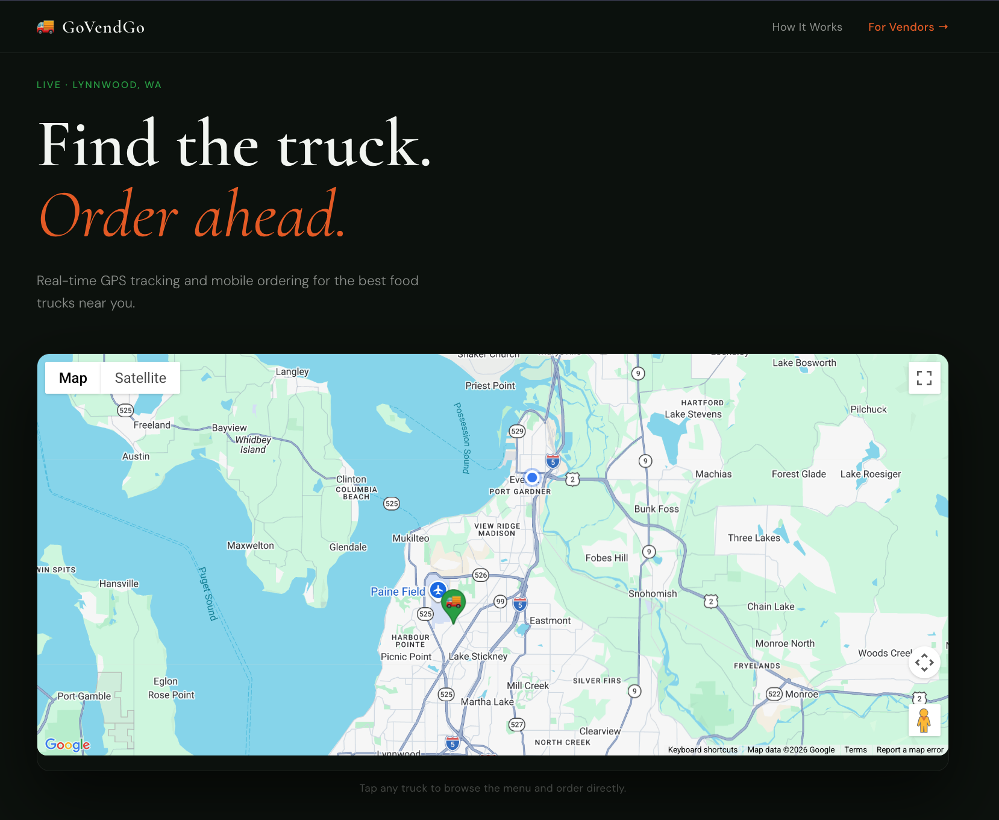
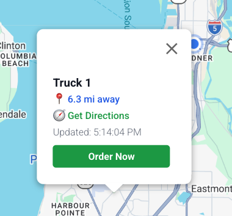
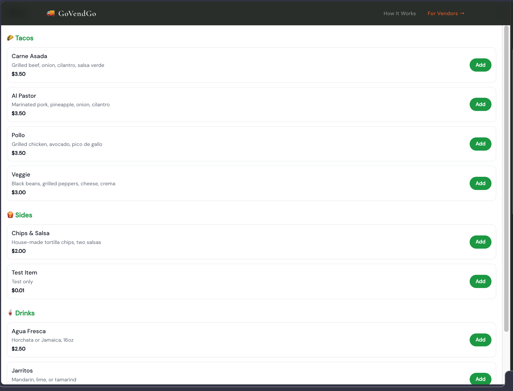
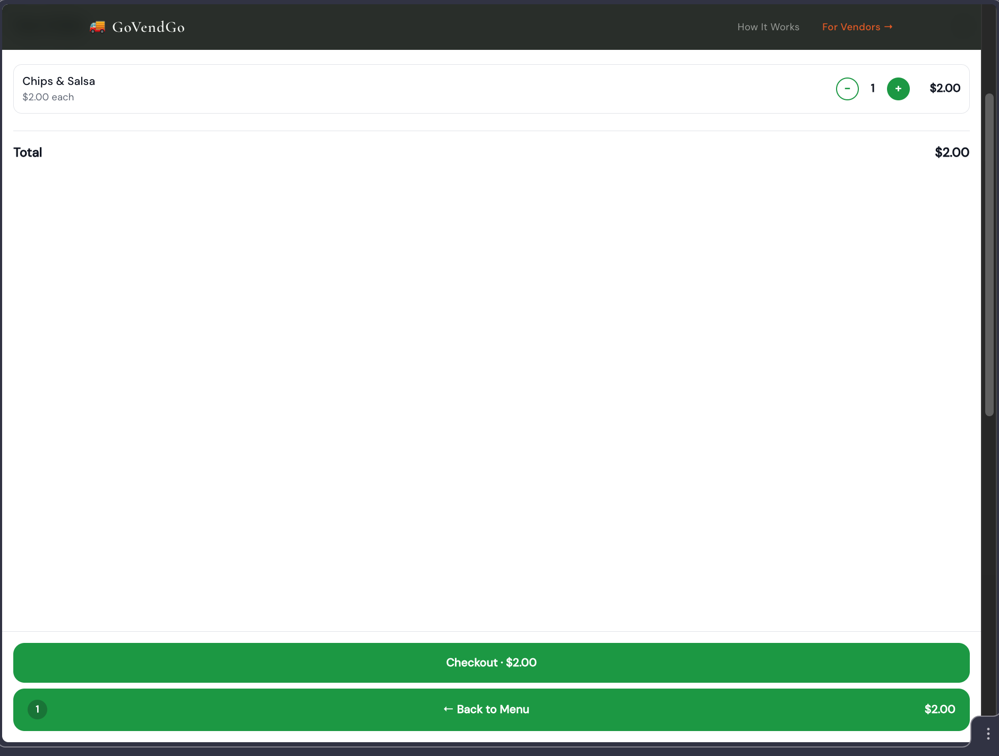
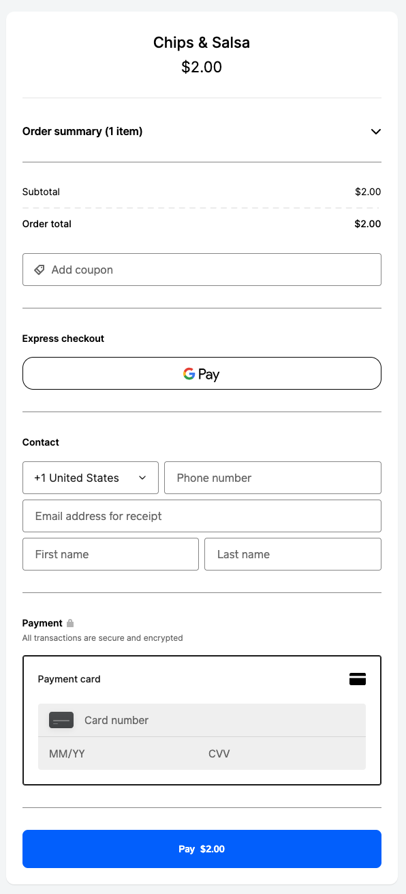
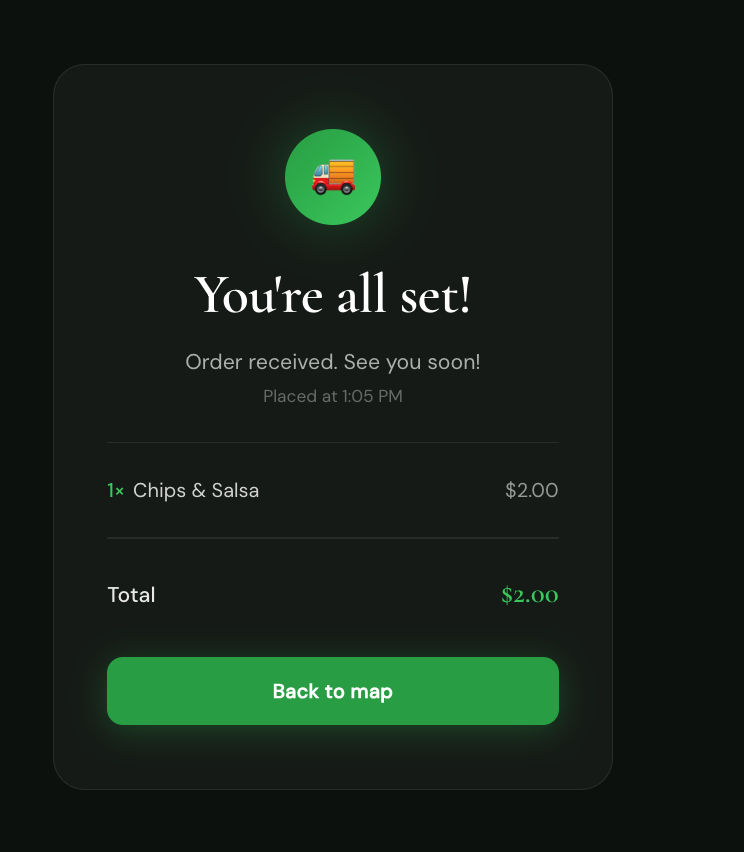

# 🚚 GoVendGo

**Real-time GPS tracking and mobile ordering for food trucks.**

🌐 **Live at [govendgo.com](https://govendgo.com)**

---

GoVendGo is a production-grade, full-stack SaaS platform built from scratch — featuring live GPS hardware, real-time map updates, a complete mobile ordering flow, and Square-powered payments verified end-to-end. Currently serving food truck operators on the Highway 99 corridor in Lynnwood/Everett, WA.

**Built with:** Next.js 14 · Supabase real-time · Google Maps · Square API · MicroPython on ESP32 · Cellular GPS (LILYGO T-SIM7600G-H R2) · Deployed on Vercel

---

## 🟢 Project Status

| | |
|---|---|
| **Production URL** | [govendgo.com](https://govendgo.com) |
| **Payments** | Square production environment — verified end-to-end with real transaction |
| **GPS** | ESP32 + MicroPython live over Wi-Fi · Cellular swap in progress (LILYGO T-SIM7600G-H R2) |
| **Database** | Supabase Postgres with real-time WebSocket subscriptions |
| **Deployment** | Auto-deploys on push to `main` via Vercel |

---

## Screenshots

| Landing Page | Live Map | Menu |
|---|---|---|
|  |  |  |

| Cart | Square Checkout | Order Confirmation |
|---|---|---|
|  |  |  |

---

## Features

- **Live GPS tracking** — Trucks post their location every 30 seconds via ESP32 hardware over cellular. Supabase real-time pushes updates to every connected browser instantly — no polling.
- **Haversine distance badges** — Calculates and displays how far the truck is from the customer's current location in real time.
- **Mobile ordering** — Full menu browsing, cart management, and Square-hosted checkout — all before the customer leaves their seat.
- **iOS/Android-aware directions** — One tap opens Apple Maps on iOS or Google Maps on Android with turn-by-turn routing to the truck.
- **Order confirmation** — Post-payment screen shows a branded summary with line items, total, and order timestamp. Survives Square's external redirect via `localStorage`.
- **Square Payment Links API** — Production-grade checkout with automatic sandbox/production switching via `NODE_ENV`.

---

## Architecture

```
Customer Browser
      │
      ▼
  Next.js 14 (Vercel — govendgo.com)
  ├── page.tsx               — Landing page + map hero
  ├── TruckMap.tsx           — Google Maps + Supabase real-time subscription
  ├── MenuModal.tsx          — Menu, cart, checkout flow
  ├── /api/checkout          — Square Payment Links API route
  └── /order-confirmation    — Post-payment confirmation page
      │
      ▼
  Supabase (Postgres + Real-time WebSockets)
  ├── truck_locations        — lat/lng, recorded_at, truck_id
  └── menu_items             — name, description, price, category
      ▲
      │
  ESP32 / LILYGO T-SIM7600G-H R2 (MicroPython)
  └── POST lat/lng every 30s → Supabase REST API
       ├── Wi-Fi mode (dev/testing)
       └── Hologram cellular SIM (production)
```

---

## Tech Stack

### Frontend
- [Next.js 14](https://nextjs.org/) + TypeScript
- [`@vis.gl/react-google-maps`](https://visgl.github.io/react-google-maps/) — live truck tracking map
- Cormorant Garamond + DM Sans typography
- Deployed on [Vercel](https://vercel.com)

### Backend
- [Supabase](https://supabase.com) — Postgres + real-time WebSocket subscriptions
- `REPLICA IDENTITY FULL` on `truck_locations` for real-time UPDATE events
- RLS: public read, anonymous UPDATE

### Payments
- [Square API](https://developer.squareup.com/) — Payment Links API (`square` npm package)
- `NODE_ENV === 'production'` switches between sandbox (local) and production (Vercel) credentials automatically

### IoT / Hardware
- **ESP32-WROOM-32** running MicroPython — GPS simulation over Wi-Fi
- **LILYGO T-SIM7600G-H R2** — cellular GPS hardware (in progress)
- **Hologram SIM** — APN: `hologram`, 6MB cap, pay-as-you-go
- `mpremote` for firmware deployment over serial

---

## Local Development

```bash
# Clone the repo
git clone https://github.com/alexjowilson/taco-truck.git
cd taco-truck

# Install dependencies
npm install

# Set up environment variables
cp .env.local.example .env.local
# Fill in your Supabase, Google Maps, and Square sandbox keys

# Run the dev server
npm run dev
```

Open [http://localhost:3000](http://localhost:3000).

### Environment Variables

| Variable | Used In |
|---|---|
| `NEXT_PUBLIC_GOOGLE_MAPS_API_KEY` | TruckMap.tsx |
| `NEXT_PUBLIC_SUPABASE_URL` | Supabase client + config.py |
| `NEXT_PUBLIC_SUPABASE_ANON_KEY` | Supabase client + config.py |
| `SQUARE_SANDBOX_ACCESS_TOKEN` | route.ts (local dev) |
| `SQUARE_SANDBOX_LOCATION_ID` | route.ts (local dev) |
| `SQUARE_ACCESS_TOKEN` | route.ts (production) |
| `SQUARE_LOCATION_ID` | route.ts (production) |
| `SQUARE_APP_ID` | route.ts (production) |
| `NEXT_PUBLIC_BASE_URL` | Square redirect URL |

---

## Hardware Setup (ESP32)

```bash
# Flash MicroPython firmware, then deploy files to the board
mpremote connect /dev/tty.SLAB_USBtoUART fs cp hardware/esp32/main.py :main.py
mpremote connect /dev/tty.SLAB_USBtoUART fs cp hardware/esp32/config.py :config.py
```

`config.py` contains credentials and is excluded from Git. See `config.py.example` for required fields.

**Cellular swap checklist (when LILYGO arrives):**
- [ ] Remove `connect_wifi()` block from `main.py`
- [ ] Add cellular init with APN: `hologram`
- [ ] Change `POST_INTERVAL` from 2s to 30s
- [ ] Replace waypoints loop with real SIM7600 GPS reads

---

## Deployment

Auto-deploys to [govendgo.com](https://govendgo.com) on every push to `main` via Vercel.

```bash
git add .
git commit -m "your message"
git push origin main
```

---

## About

This project is now branded as **GoVendGo** — a platform for food truck operators to manage real-time GPS tracking and mobile ordering. The repository name reflects the original prototype.

Built by [Alex Wilson](https://github.com/alexjowilson).
