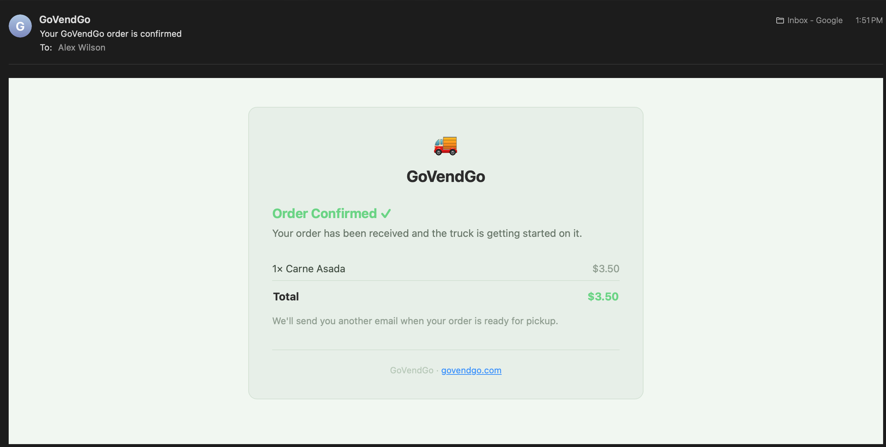
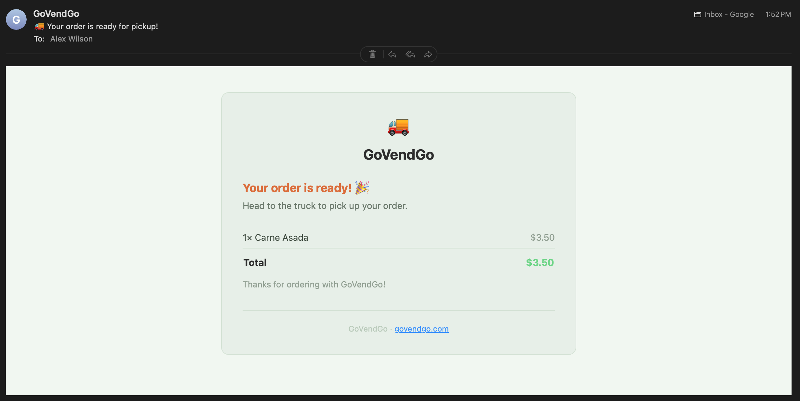
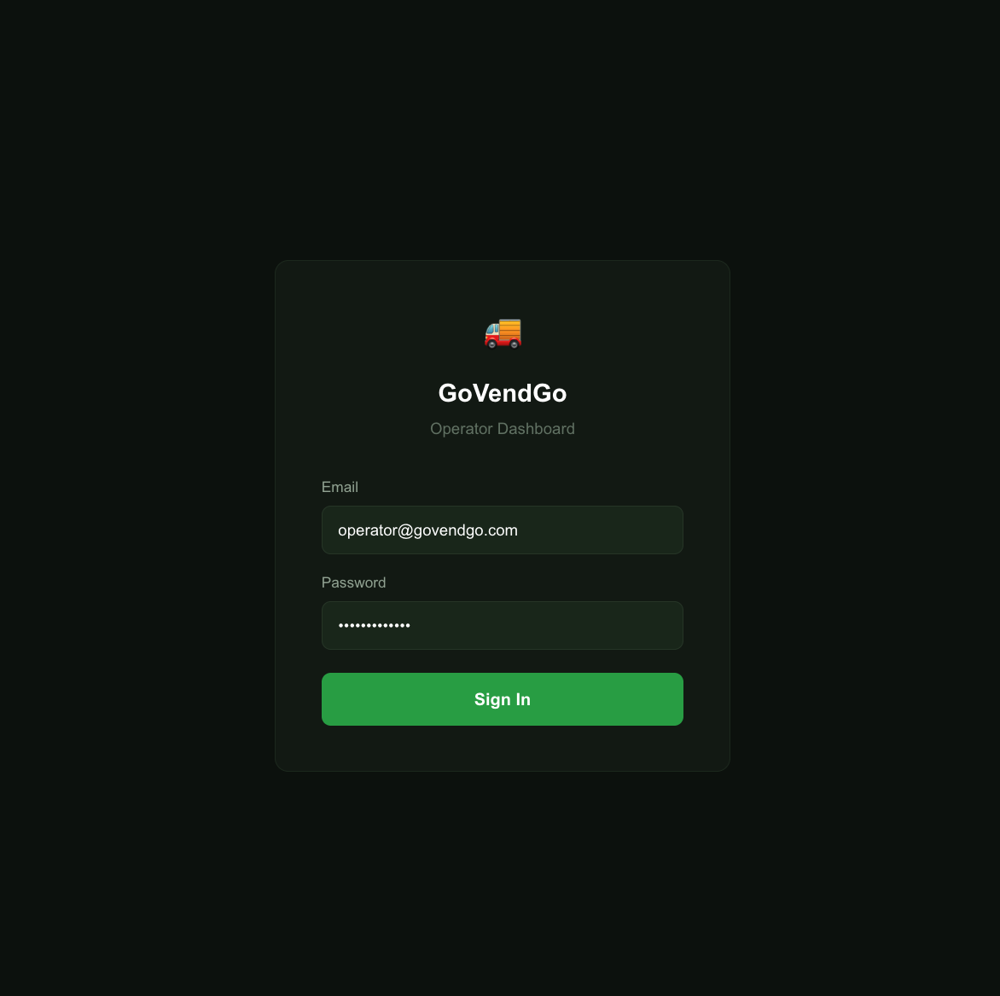
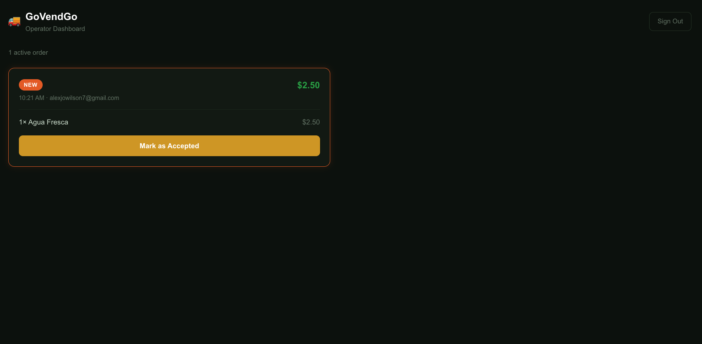
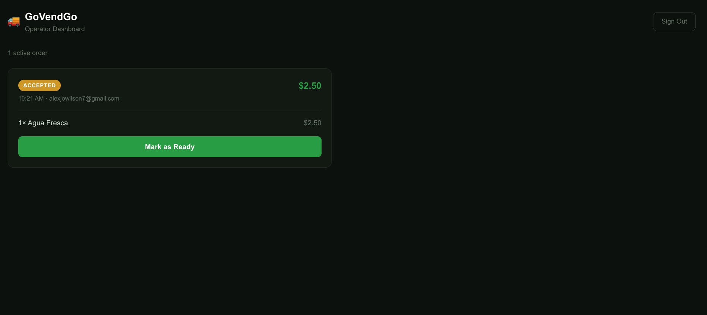
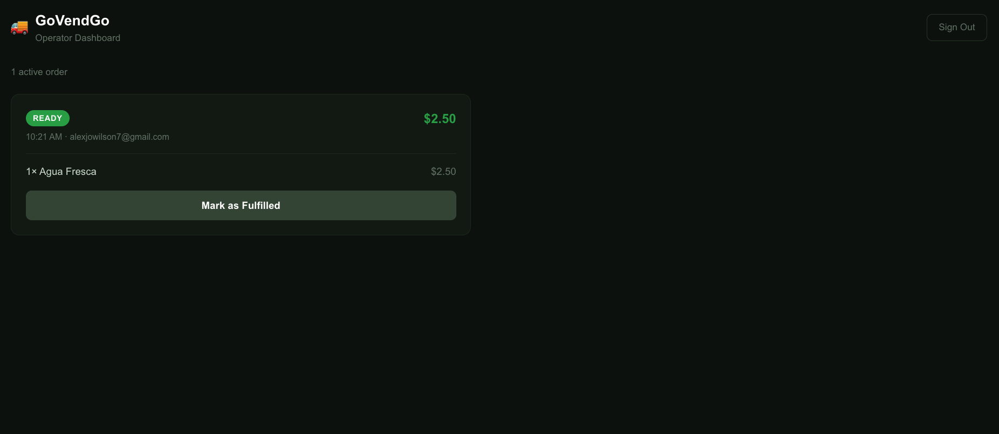

# 🚚 GoVendGo

**Real-time GPS tracking, mobile ordering, and operator management for food trucks.**

🌐 **Live at [govendgo.com](https://govendgo.com)**

---

GoVendGo is a production-grade, full-stack SaaS platform built from scratch — featuring live cellular GPS hardware, real-time map updates, a complete mobile ordering flow, Square-powered payments, a real-time operator dashboard, and automated customer email notifications verified end-to-end. Currently serving food truck operators on the Highway 99 corridor in Lynnwood/Everett, WA.

**Built with:** Next.js 14 · Supabase real-time · Google Maps · Square API · Resend · MicroPython on ESP32 · Cellular GPS (LILYGO T-SIM7600G-H R2) · Deployed on Vercel

---

## 🟢 Project Status

| | |
|---|---|
| **Production URL** | [govendgo.com](https://govendgo.com) |
| **Payments** | Square production environment — verified end-to-end with real transaction |
| **GPS** | LILYGO T-SIM7600G-H R2 over Verizon LTE — real coordinates posting every 30s |
| **Database** | Supabase Postgres with real-time WebSocket subscriptions |
| **Operator Dashboard** | Live — real-time order feed, status flow, audio alerts, per-truck auth |
| **Email Notifications** | Live — order confirmed + order ready emails from orders@govendgo.com |
| **Deployment** | Auto-deploys on push to `main` via Vercel |

---

## Screenshots

### Customer Flow

| Landing Page | Live Map | Menu |
|---|---|---|
|  |  |  |

| Cart | Square Checkout | Order Confirmation |
|---|---|---|
|  |  |  |

### Email Notifications

| Order Confirmed | Order Ready |
|---|---|
|  |  |

### Operator Flow

| Login | New Order | Accepted |
|---|---|---|
|  |  |  |

| Ready | Dashboard |
|---|---|
|  |  |

---

## Features

### Customer
- **Live cellular GPS tracking** — Trucks post their location every 30 seconds via LILYGO T-SIM7600G-H R2 hardware over Verizon LTE. Supabase real-time pushes updates to every connected browser instantly — no polling.
- **Relative timestamps** — InfoWindow shows how recently the truck location was updated (e.g. "30s ago", "2m ago").
- **Haversine distance badges** — Calculates and displays how far the truck is from the customer's current location in real time.
- **Mobile ordering** — Full menu browsing, cart management, and Square-hosted checkout — all before the customer leaves their seat.
- **iOS/Android-aware directions** — One tap opens Apple Maps on iOS or Google Maps on Android with turn-by-turn routing to the truck.
- **Order confirmation page** — Post-payment screen shows a branded summary with line items, total, and order timestamp. Survives Square's external redirect via `localStorage`.
- **Order confirmed email** — Automatically sent to the customer on payment completion, from `orders@govendgo.com`. Shows line items, total, and sets expectation for the ready notification.
- **Order ready email** — Sent to the customer the moment the operator marks their order ready. Prompts them to head to the truck for pickup.
- **Square Payment Links API** — Production-grade checkout with automatic sandbox/production switching via `NODE_ENV`.

### Operator
- **Secure login** — Email-based auth via Supabase, scoped per truck. Each operator sees only their own orders.
- **Real-time order feed** — New orders appear instantly via Supabase WebSocket subscription — no refresh required.
- **Audio + visual alerts** — New orders trigger an audio ping and an orange border pulse so operators never miss an incoming order.
- **Status flow** — One-tap status progression: New → Accepted → Ready → Fulfilled. Fulfilled orders drop off the feed automatically.
- **Square webhook pipeline** — Completed Square payments write to Supabase in real time via HMAC-verified webhooks. No manual order entry.

---

## Architecture

```
Customer Browser
      │
      ▼
  Next.js 14 (Vercel — govendgo.com)
  ├── page.tsx                  — Landing page + map hero
  ├── TruckMap.tsx              — Google Maps + Supabase real-time subscription
  ├── MenuModal.tsx             — Menu, cart, checkout flow
  ├── /api/checkout             — Square Payment Links API route
  ├── /api/webhooks/square      — HMAC-verified Square webhook → Supabase + Resend
  ├── /api/orders/notify        — Order ready email trigger (called by dashboard)
  ├── /order-confirmation       — Post-payment confirmation page
  ├── /login                    — Operator login (Supabase Auth)
  └── /dashboard                — Real-time operator order feed
      │
      ▼
  Supabase (Postgres + Real-time WebSockets)
  ├── truck_locations           — lat/lng, recorded_at, truck_id
  ├── menu_items                — name, description, price, category
  ├── orders                    — square_order_id, truck_id, status, total, customer_email
  ├── order_items               — line items per order (linked via order_id FK)
  └── truck_operators           — user_id → truck_id (auth scoping)
      ▲                ▲
      │                │
  LILYGO T-SIM7600G-H R2    Square Webhook (payment.updated)
  MicroPython over LTE       HMAC verified, writes on COMPLETED
                             └── Resend → orders@govendgo.com
                                  ├── Order Confirmed (on payment)
                                  └── Order Ready (on operator action)
```

---

## Tech Stack

### Frontend
- [Next.js 14](https://nextjs.org/) + TypeScript
- [`@vis.gl/react-google-maps`](https://visgl.github.io/react-google-maps/) — live truck tracking map
- [`@supabase/ssr`](https://supabase.com/docs/guides/auth/server-side/nextjs) — server-side auth with middleware session handling
- Cormorant Garamond + DM Sans typography
- Deployed on [Vercel](https://vercel.com)

### Backend
- [Supabase](https://supabase.com) — Postgres + real-time WebSocket subscriptions
- `REPLICA IDENTITY FULL` on `truck_locations`, `orders`, and `order_items` for real-time events
- RLS policies scoped per operator via `truck_operators` join table and `auth.uid()`
- Service role key used server-side only for webhook writes (bypasses RLS)

### Payments
- [Square API](https://developer.squareup.com/) — Payment Links API + Webhook subscriptions
- `payment.updated` webhook filtered on `status === 'COMPLETED'`
- HMAC signature verification on every incoming webhook
- `NODE_ENV === 'production'` switches between sandbox (local) and production (Vercel) credentials automatically

### Email
- [Resend](https://resend.com) — transactional email API
- Custom domain verified — all emails send from `orders@govendgo.com`
- DKIM, SPF, and MX records configured via Cloudflare auto-configure
- Email failures never block webhooks or dashboard UI — isolated try/catch on all sends

### IoT / Hardware
- **LILYGO T-SIM7600G-H R2** — cellular GPS hardware, live on Verizon LTE
- **MicroPython v1.28.0** — AT command HTTP stack, RTC sync via `AT+CCLK`, real GPS reads
- **Hologram SIM** — APN: `hologram`, 6MB cap, pay-as-you-go
- `mpremote` for firmware deployment over serial

---

## Local Development

```bash
# Clone the repo
git clone https://github.com/alexjowilson/taquero.git
cd taquero

# Install dependencies
npm install

# Set up environment variables
cp .env.local.example .env.local
# Fill in your Supabase, Google Maps, Square sandbox, and Resend keys

# Run the dev server
npm run dev
```

Open [http://localhost:3000](http://localhost:3000).

### Environment Variables

| Variable | Used In |
|---|---|
| `NEXT_PUBLIC_GOOGLE_MAPS_API_KEY` | TruckMap.tsx |
| `NEXT_PUBLIC_SUPABASE_URL` | Supabase client |
| `NEXT_PUBLIC_SUPABASE_ANON_KEY` | Supabase client |
| `SUPABASE_SERVICE_ROLE_KEY` | Square webhook + notify routes (server-side only) |
| `SQUARE_SANDBOX_ACCESS_TOKEN` | route.ts (local dev) |
| `SQUARE_SANDBOX_LOCATION_ID` | route.ts (local dev) |
| `SQUARE_ACCESS_TOKEN` | route.ts (production) |
| `SQUARE_LOCATION_ID` | route.ts (production) |
| `SQUARE_APP_ID` | route.ts (production) |
| `SQUARE_WEBHOOK_SIGNATURE_KEY` | webhooks/square/route.ts |
| `NEXT_PUBLIC_BASE_URL` | Square redirect URL |
| `RESEND_API_KEY` | email.ts (server-side only) |

---

## Hardware Setup

```bash
# Deploy firmware files to the board
mpremote connect /dev/tty.usbserial-5B212339991 fs cp hardware/esp32/main.py :main.py
mpremote connect /dev/tty.usbserial-5B212339991 fs cp hardware/esp32/config.py :config.py
```

`config.py` contains credentials and is excluded from Git. See `config.py.example` for required fields.

> **Note:** The serial port `/dev/tty.usbserial-5B212339991` is specific to the LILYGO board. Auto-detection fails — always specify the port explicitly. If the port is locked, run `pkill -f screen` to release it.

---

## Deployment

Auto-deploys to [govendgo.com](https://govendgo.com) on every push to `main` via Vercel.

```bash
git add .
git commit -m "your message"
git push origin main
```

---

## About

GoVendGo is a real-time food truck platform for GPS tracking, mobile ordering, operator management, and customer notifications. Built as a production SaaS product targeting food truck operators on the Highway 99 corridor in the Lynnwood/Everett, WA area.

Built by [Alex Wilson](https://github.com/alexjowilson).
