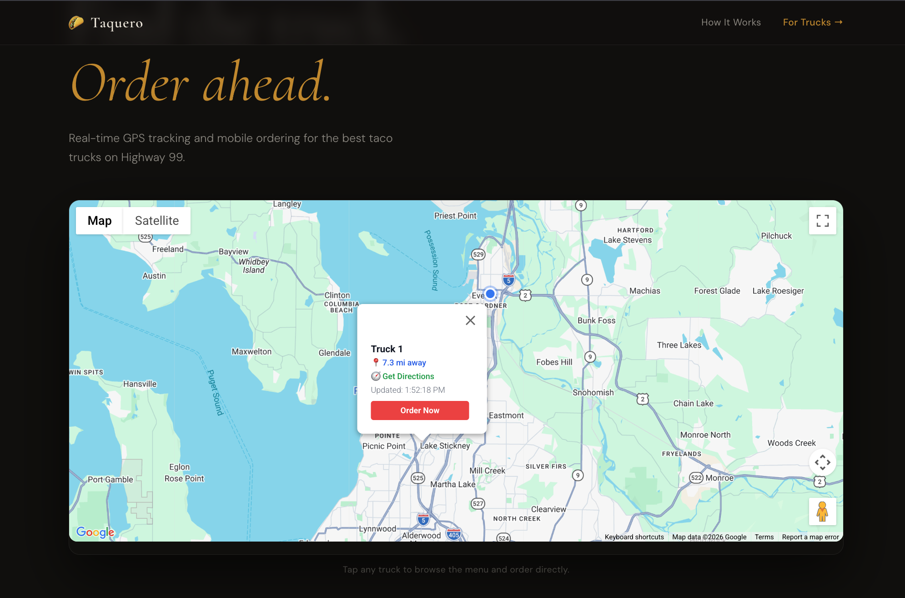
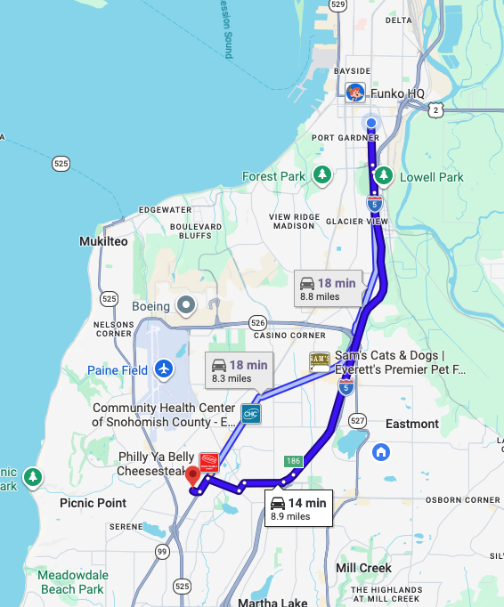
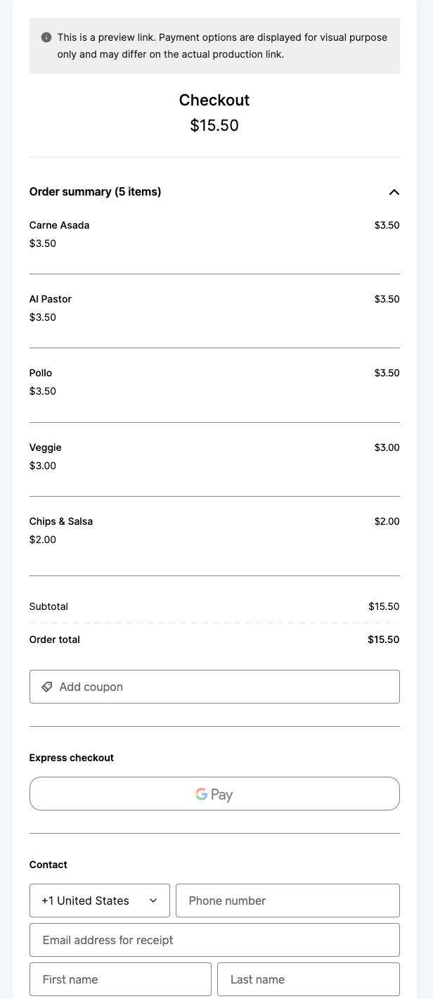
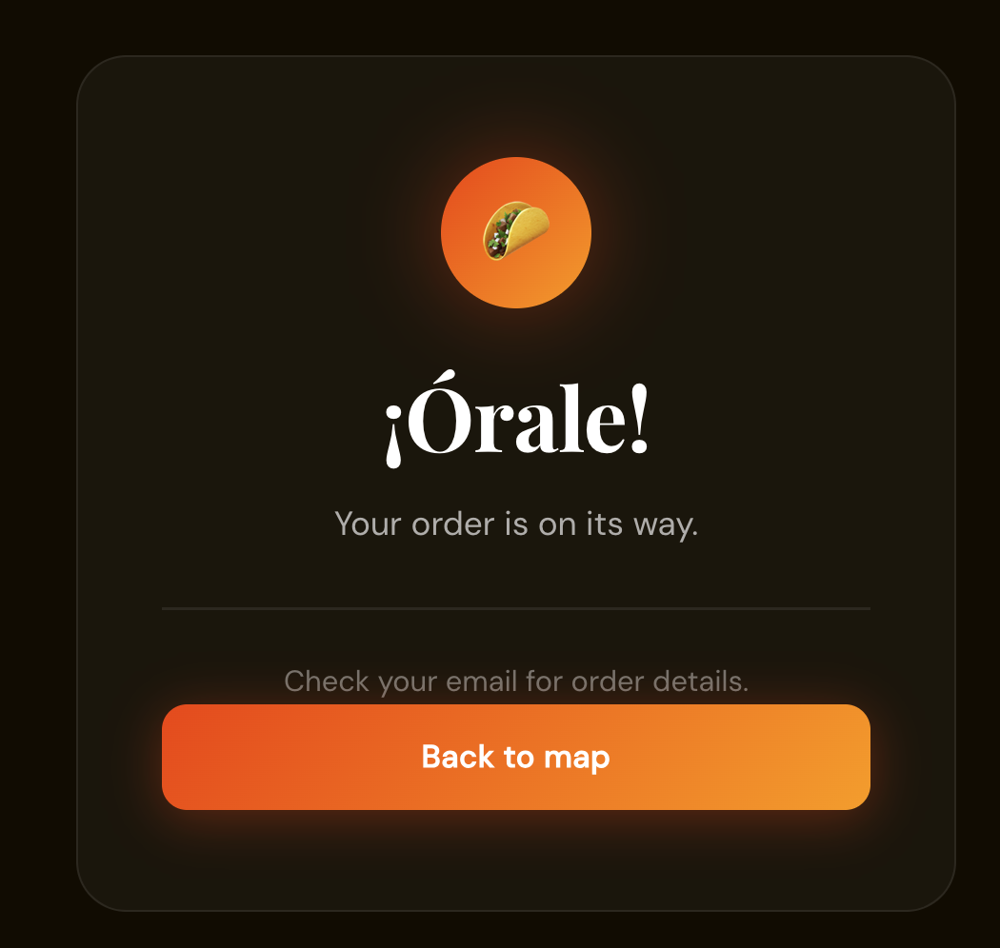
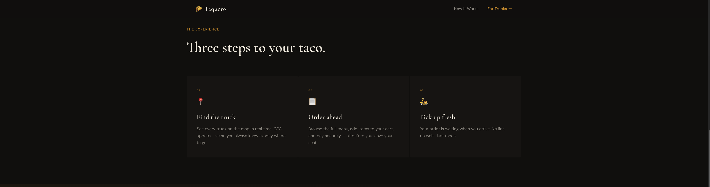
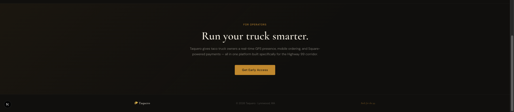

# 🌮 Taquero
**Taquero** is a real-time GPS tracking and ordering platform for taco trucks. Customers can find nearby trucks on a live map, browse the menu, build a cart, and check out — all in one flow.
Built for the Lynnwood, WA Highway 99 market.

---

## Screenshots

### Landing Page


### Live Map — Find the Truck
Detects the user's location and auto-fits the map to frame both the customer and nearby trucks. Tap any pin to see the truck's distance and get directions.



### Get Directions
Opens Apple Maps on iOS, Google Maps everywhere else.



### Browse the Menu


### Add Items to Your Order


### Checkout via Square


### Order Confirmation


### How It Works


### For Operators


---

## Tech Stack

### Frontend
| Technology | Purpose |
|---|---|
| [Next.js 14](https://nextjs.org) | React framework, routing, SSR |
| TypeScript | Type safety across the app |
| [@vis.gl/react-google-maps](https://visgl.github.io/react-google-maps/) | Interactive map with custom markers, InfoWindows, and fitBounds |

### Backend & Data
| Technology | Purpose |
|---|---|
| [Supabase](https://supabase.com) | Postgres database + real-time subscriptions for live GPS updates |
| Row Level Security (RLS) | Public read policy on `truck_locations` and `menu_items` tables |

### Payments
| Technology | Purpose |
|---|---|
| [Square API](https://developer.squareup.com) | Server-side payment link creation via `paymentLinks.create()`, hosted checkout flow |

### IoT / Hardware (GPS Tracking)
| Device | Purpose |
|---|---|
| [LILYGO T-SIM7600G-H R2](https://www.lilygo.cc) | Cellular-connected dev board — primary GPS unit on the truck |
| [Hologram SIM](https://www.hologram.io) | Pay-as-you-go cellular data (APN: `hologram`) |
| Samsung 18650 Li-ion Cell | Power supply for the LILYGO board |
| ESP32-WROOM-32 | Dev/testing board for MicroPython GPS simulation over Wi-Fi |

### Firmware
| Technology | Purpose |
|---|---|
| MicroPython | Runs on ESP32/LILYGO — POSTs GPS coordinates to Supabase every 30 seconds |

### Infrastructure
| Technology | Purpose |
|---|---|
| [Vercel](https://vercel.com) | Deployment and hosting |

---

## How It Works

1. **GPS Hardware** — A LILYGO T-SIM7600G-H R2 board on the truck reads GPS coordinates and POSTs them to Supabase every 30 seconds over the cellular network via a Hologram SIM.
2. **Real-Time Updates** — The Next.js frontend subscribes to the `truck_locations` table via Supabase real-time, updating the map pin live without a page refresh.
3. **Smart Map** — On load, the app requests the user's location and auto-fits the map viewport to frame both the customer and all active trucks. Distance badges and directions are shown per truck.
4. **Order Flow** — Customers tap the truck pin → browse the menu → add items to cart → checkout via Square's hosted payments page → land on a branded order confirmation screen.

---

## Getting Started

```bash
npm run dev
```

Open [http://localhost:3000](http://localhost:3000) to see the app.

### Environment Variables

Create a `.env.local` file at the project root:

```env
NEXT_PUBLIC_GOOGLE_MAPS_API_KEY=your_google_maps_key
NEXT_PUBLIC_SUPABASE_URL=your_supabase_url
NEXT_PUBLIC_SUPABASE_ANON_KEY=your_supabase_anon_key
SQUARE_SANDBOX_ACCESS_TOKEN=your_square_sandbox_token
SQUARE_SANDBOX_LOCATION_ID=your_square_location_id
NEXT_PUBLIC_BASE_URL=http://localhost:3000
```

---

## Project Structure

```
src/
├── app/
│   ├── page.tsx                    # Landing page — hero, map, how it works, CTA
│   ├── order-confirmation/
│   │   └── page.tsx                # Post-payment confirmation screen
│   └── api/
│       └── checkout/
│           └── route.ts            # Square payment link creation (server-side)
├── components/
│   ├── map/
│   │   └── TruckMap.tsx            # Live map — geolocation, fitBounds, markers
│   └── menu/
│       └── MenuModal.tsx           # Full-screen menu, cart, and checkout flow
├── context/
│   └── CartContext.tsx             # useReducer cart state — add, increment, decrement, clear
├── hooks/
│   ├── useTruckLocations.ts        # Supabase real-time truck GPS subscription
│   └── useMenuItems.ts             # Fetches and groups menu items by category
└── types/
    └── database.ts                 # Shared TypeScript types
```

---

## Deployment

Deployed on [Vercel](https://vercel.com). Push to `main` to deploy.

> **Note:** Swap `SQUARE_SANDBOX_ACCESS_TOKEN` for production credentials and set `SquareEnvironment.Production` in `src/app/api/checkout/route.ts` before going live.